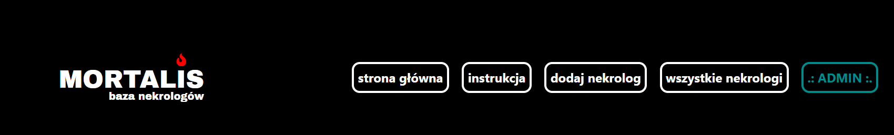
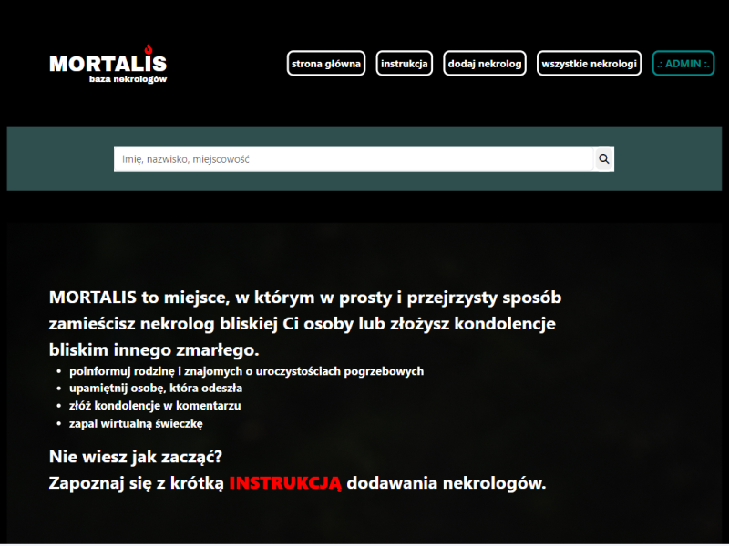
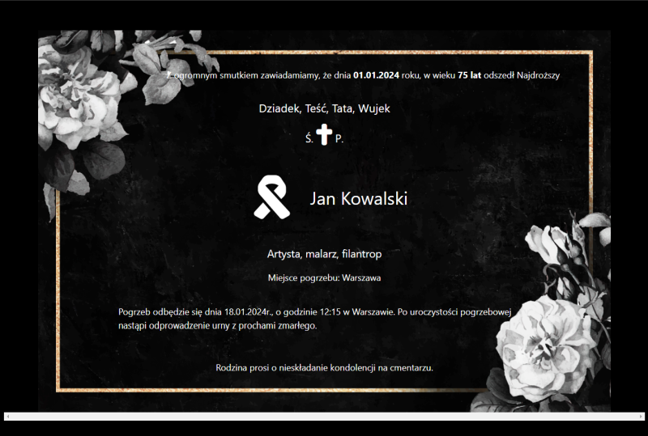
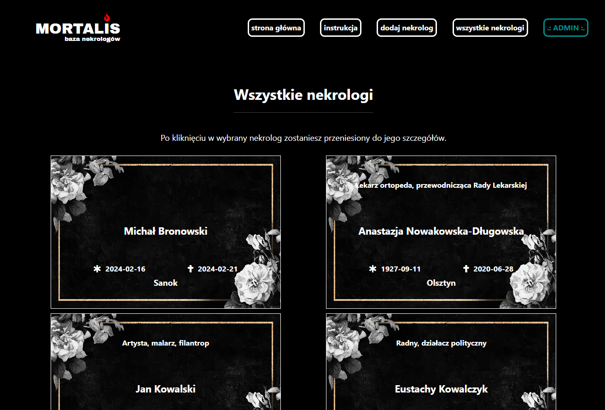
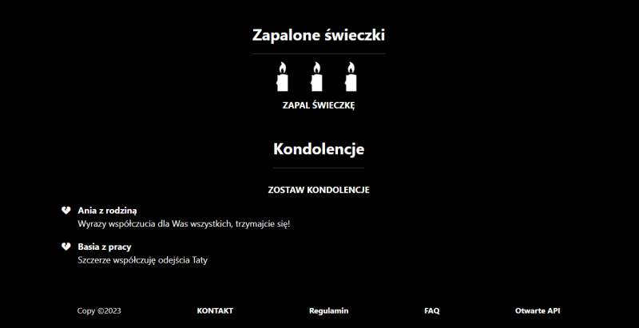

# MORTALIS - necrology web app

> This web app allows you add and find necrologies - share funeral details, share private memory of late relative, search through other necrologies, light a virtual candle or write condolences.  
> Overall look demo [_here_](https://youtu.be/DRQPNL8EX_Q). 
> Admin panel demo [_here_](https://youtu.be/SUeECTA2eac). 
> API demo [_here_](https://youtu.be/nIrDqsFL3Fc).

## Content of project

- [General Info](#general-information)
- [Technologies Used](#technologies-used)
- [Features](#features)
- [Screenshots](#screenshots)
- [Setup](#setup)
- [Usage](#usage)
- [Project Status](#project-status)
- [Room for Improvement](#room-for-improvement)
- [Sources](#sources)
- [Contact](#contact)

## General Information

  
Click here to see general information about <b>Mortalis</b>.

  <b>Mortalis</b> is designed strictly for polish users, so it has visual features used commonly in polish obituaries.
  The app lets you add necrologies of your late realtives, light them multiple virtual candles in memoriam, write condolences, search through other necrologies. It includes basic API, admin /     moderator management of content. It's the place where you can mourn your close ones, leave few words of memories you shared with the late person etc.

## Technologies Used

  

     - version 17
  

 
  

    

      
    

  

    

       - version 3.2.1
    

    

      <ul>
        <li>Thymeleaf layout dialect - version 3.3.0</li>
        <li>Thymeleaf extras spring security - version 3.1.2</li>
      </ul>
    

  

  

    

       - version 3.2.2
    

    

      <ul>
        <li>Spring Data JPA</li>
        <li>Spring Security</li>
        <li>Spring Validation</li>
        <li>Spring Web</li>
        <li>Spring Test</li>
        <li>Spring Mail</li>
      </ul>
    

  

  

     - version 4.24.0
  

  

    
H2 Database - version 2.2.224

  

  

    
  

  

    
Lombok - version 1.18.30

  

  

    
  

  

    
  

  

    
  

  

    
  

  

     - version 5.3.2
  

  

    
  

  

    
JUnit, mockito, assertj

  

## Features

Ready features:

<b>Necrology adding</b>:

<ul>
  <li>form with validated required fields</li>
  <li>personal data of late person, funeral details, picking kinship from database list and other minor features</li>
  <li>ability to check for automaticaly necrology removing after 14 days</li>
  <li>dynamic preview of necrology while filling form</li>
  <li>verification with activation code via e-mail message</li>
</ul>

<b>Candle adding:</b>

<ul>
  <li>form with validated required fields</li>
  <li>ability to light a candle for 30 days</li>
  <li>verification with activation code via e-mail message</li>
</ul>

<b>Condolences adding:</b>

<ul>
  <li>form with validated required fields (bad words filter)</li>
  <li>ability to add text and signature of person adding</li>
  <li>verification with activation code via e-mail message</li>
</ul>

<b>all added activated necrologies list with pagination</b>

<b>showing only previously activated necrologies, candles and condolences in public part of the service</b>

<b>showing last 10 added necrologies on main page as a preview of basic necrology information</b>

<b>searching through necrology database (by name or place of living / funeral)</b>

<b>admin / moderator account for simple moderation of added necrologies and condolences (currently available only necrology or condolences removing and editing options)</b>

<b>automaticaly removed records from database when:</b>

<ul>
  <li>expired (necrologies, candles)</li>
  <li>not activated by user (necrologies, candles and condolences)</li>
</ul>

<b>simple API for potential local services (ability to get data such as total necrologies number in database, list of necrologies with particular name or place of funeral, single necrology by known Id number, etc.; output in JSON format)</b>

<b>included instruction, FAQ, website regulations</b>

## Screenshots

## Setup

- CLONING REPOSITORY

If you want to clone this repo and launch it for example in IntelliJ please write this in command line:

<code>$ git clone https://github.com/MalTok/Mortalis-App.git</code>

- INSTALLATION

If ou want to download this repository and install it, please make sure that you have Java 17 (or newest) installed on your comupter. Also make sure that the enviroment variable PATH is properly set.

Next please download the JAR file <b>mortalis-0.0.1-SNAPSHOT.jar</b>.
In command line go to the directory with the JAR file and install it by writing this command:
<code>$ java -jar mortalis-0.0.1-SNAPSHOT.jar</code>

After these steps it will be available in your browser at <code>localhost:8080</code>.

There are two configurations available: dev (default, recommended) and prod (requires MySQL installed).

Admin panel access:

- login: admin@byom.de
- password: hard

Inbox e-mail addresses for testing can be set up at: byom.de

## Usage

  
Click here to see possible usage of <b>Mortalis</b>.

  This app can be used by any funeral home or by country-wide service managing obituaries. Implemented API can be used by various local services to gather info and statistics about locals who     recently passed away.

## Project Status

Project is: _in progress_ 
Working on new, possible features.

## Room for Improvement

Room for improvement:

<ul>
  <li>Admin / moderator panel - add more options</li>
  <li>Mobile phones display optimalization (especially necrology previews)</li>
</ul>

Ideas:

<ul>
  <li>"Request for a change" - option for users which allows to edit necrologies</li>
  <li>Ability to choose icon which is displayed by te condolences</li> 
  <li>More necrology customization (like icons for diferent religions etc.)</li>
  <li>Adding payment option</li>
  <li>When payment will be added - add ability to sign up for normal users, free limit of necrologis per month per user - necrologies above limit will be charged (for example for funeral companies)</li>
</ul>

## Sources

- This project was inspired by the look and functionality of webpage [zmarli.info](https://zmarli.info/), which commercial on YT I saw some time ago
- All of the pictures used in this project come from [freepik.com](https://pl.freepik.com/) (authors: mdjaff, rawpixel.com, freepik)

## Contact

Feel free to contact me via GitHub or e-mail!
